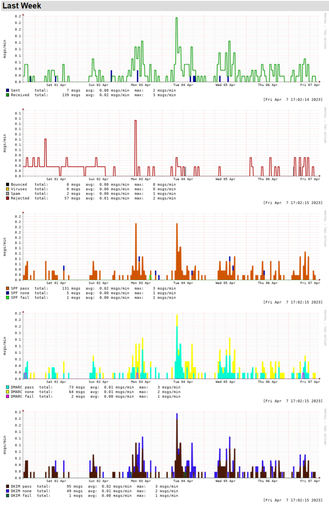
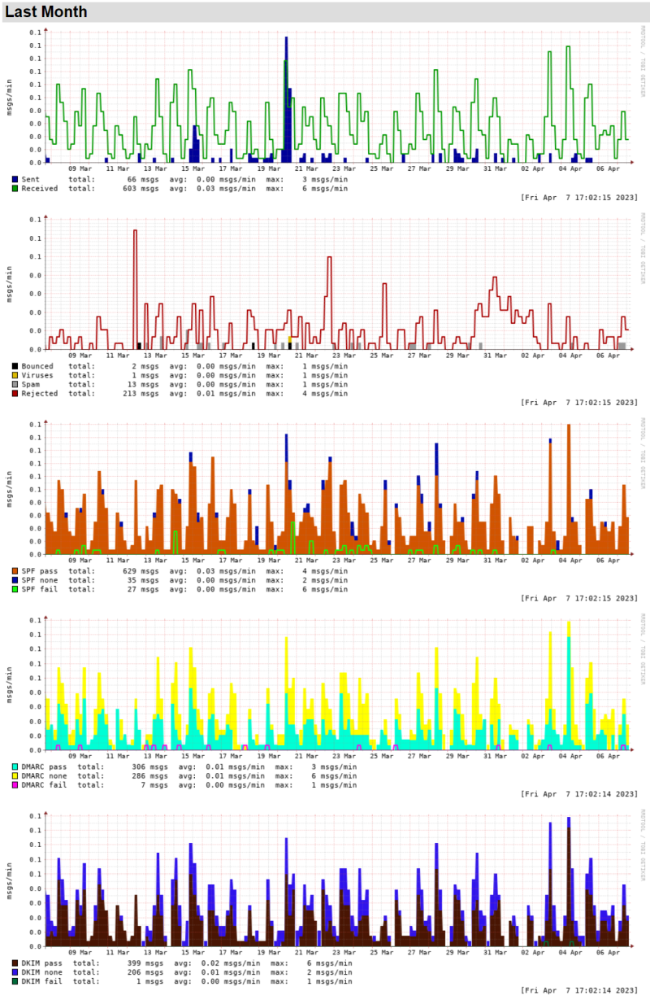

This project allows you to run Mailgraph inside a docker container.
It is based on the [Mailgraph](https://mailgraph.schweikert.ch) project from David Schweikert with dkim-, dmarc, spf-patch from [Sebastian van de Meer](https://www.kernel-error.de/2014/04/22/mailgraph-graphen-um-spf-dmarc-und-dkim-erweitern/). 

The docker image is available at [Docker Hub](https://hub.docker.com/r/davidullrich/mailgraph).

# Usage

To run the container you need to mount the mail.log file into the container to `/var/log/mail/mail.log` and provide a path or volume to store the rrd files at `/var/www/mailgraph/rrd`.

``` bash
docker run --rm -d \
  -v /var/log/mail/mail.log:/var/log/mail/mail.log \
  -v /var/data/mailgraph/rrd/:/var/www/mailgraph/rrd/ \
  -p 8080:80 \
  davidullrich/mailgraph:latest
```

Graphs are served at http://localhost:8080/mailgraph/


## Docker Compose

``` yaml
version: '3'

services:
  mailgraph:
    image: davidullrich/mailgraph:latest
    hostname: mail.example.com
    volumes:
      - /var/log/mail/mail.log:/var/log/mail/mail.log
      - /var/data/mailgraph/rrd/:/var/www/mailgraph/rrd/
      - /etc/localtime:/etc/localtime:ro
    restart: unless-stopped
```

## Reverse Proxy with Traefik

To hide mailgraph behind a reverse proxy and add basic authentication with traefik you can use the following labels:

``` yaml
version: '3'

services:
  mailgraph:
    image: davidullrich/mailgraph:latest
    hostname: mail.example.com
    volumes:
      - /var/log/mail/mail.log:/var/log/mail/mail.log
      - /var/data/mailgraph/rrd/:/var/www/mailgraph/rrd/
      - /etc/localtime:/etc/localtime:ro
    restart: unless-stopped
    labels:
      - "traefik.enable=true"
      - "traefik.http.routers.mailgraph-router.rule=Host(`mail.example.com`) && PathPrefix(`/mailgraph`)"
      - "traefik.http.routers.mailgraph-router.entryPoints=websecure"
      - "traefik.http.routers.mailgraph-router.service=mailgraph-service"
      - "traefik.http.services.mailgraph-service.loadBalancer.server.scheme=http"
      - "traefik.http.services.mailgraph-service.loadBalancer.server.port=80"
      - "traefik.http.routers.mailgraph-router.middlewares=mailgraph-middleware-auth"
      - "traefik.http.middlewares.mailgraph-middleware-auth.basicauth.users=user:[password-hash]"
```


# Screenshots

## Last week




## Last month


